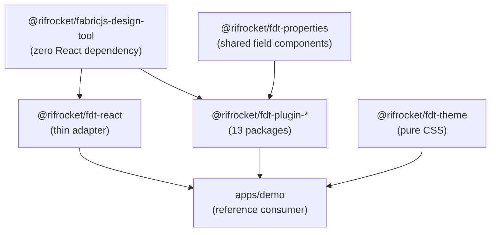

# Architecture Overview

## The monorepo

`@rifrocket/fdt-*` is a pnpm + Turborepo monorepo. Every published package lives under `packages/`; `apps/demo` is a reference consumer app (not published) that exercises the real public API end-to-end, and `apps/docs` is this documentation site.

`packages/core` has **zero React dependency** — enforced in CI by a `dependency-cruiser` rule (`core-no-react`), not just convention, so it can't silently regress the way a purely-documented boundary could. `fabric` is a peer dependency of `core`; `react`/`react-dom` are peer dependencies of `react` only. This is what makes `createEngine()` usable outside React at all, and is a deliberate reaction to an earlier version of this project where the "framework-agnostic core" claim didn't hold up — `core` actually imported React hooks.

## What `core` owns

A single class, `CanvasEngine`, owns exactly one Fabric.js `Canvas` instance and composes independently-testable managers around it:

- **`ViewportManager`** — zoom/pan
- **`SelectionManager`** — active object(s), group/ungroup
- **`LayerManager`** — z-order, visibility, lock
- **`AlignmentManager`** — align/distribute
- **`SnapEngine`** — smart-guide snapping
- **`HistoryManager`** — command-pattern undo/redo
- **`PluginRegistry`** — object types, tools, panels, effects, exporters, importers
- **`Store`** — a small observable state container
- **`EventBus`** — pub-sub with middleware support

See [The CanvasEngine](/docs/architecture/canvas-engine) for how these compose, [Store & Events](/docs/architecture/store-and-events) for the reactive model, and [History & Commands](/docs/architecture/history-and-commands) for how undo/redo actually works.

## What `react` owns

`@rifrocket/fdt-react` is intentionally thin: `<Editor>` (and the preset-driven `<DesignEditor>`) construct a `CanvasEngine` via `useCanvasEngine()`, provide it through `EditorContext`, and render three named panel slots. `useEditor()`/`useEditorState()` read from that context. Nothing in `core`'s behavior depends on React being present — see [The React Adapter](/docs/architecture/react-adapter).

## The plugin system

Every extension point — object types, tools, panels, property fields, export/import formats — is a registry inside `engine.registry`. A plugin is a plain object: `{ name, dependsOn?, install(engine), uninstall?(engine) }`. All 17 official `@rifrocket/fdt-plugin-*` packages are built against this same public API, with no special internal access — see [Plugins Overview](/docs/plugins/overview) and [Extension Points](/docs/extension-points/custom-object-types) for the full picture.

## Package export subpaths

`@rifrocket/fabricjs-design-tool` ships subpath exports (`./history`, `./effects`, `./export`) alongside its main barrel with `"sideEffects": false` set, so bundlers can tree-shake code your app doesn't touch — e.g. the PDF-adjacent export machinery — out of a bundle that only imports `createEngine`.
