# Choosing Your Entry Point

There are three ways to start an editor, at three different levels of the stack. All three end up constructing the same underlying `CanvasEngine` — they differ only in how much is pre-wired for you.

```mermaid
flowchart TD
    A["&lt;DesignEditor preset=&quot;default&quot;&gt;<br/>(@rifrocket/fdt-react)"] --> B["&lt;Editor plugins=&#123;...&#125;&gt;<br/>(@rifrocket/fdt-react)"]
    B --> C["createEngine()<br/>(@rifrocket/fabricjs-design-tool)"]

    A -.->|"batteries-included,<br/>zero config"| A
    B -.->|"a-la-carte plugins,<br/>still React"| B
    C -.->|"framework-agnostic,<br/>no React"| C
```



## `<DesignEditor>` — batteries-included

```tsx
import { DesignEditor } from "@rifrocket/fdt-react";

<DesignEditor preset="default" theme="system" width={800} height={600} />;
```

Use this when you want a general-purpose editor working immediately, and you're fine with the plugin set a named preset bundles. `preset="default"` installs `shapes-basic`, `clipboard`, `svg-import`, `image`, `effects`, `export-pdf`, and `qrcode`. `preset="minimal"` drops `qrcode`/`export-pdf`/`svg-import` for a lighter bundle. Override per-field without abandoning the preset:

```tsx
<DesignEditor
  preset="default"
  plugins={{ exclude: ["qrcode"], add: [myBrandKitPlugin] }}
  autosave={{ key: "my-app:design" }}
/>
```

Not bundled into either preset (they'd create a circular dependency on `@rifrocket/fdt-react` itself): `plugin-alignment`, `plugin-snapping`, `plugin-devtools`, `plugin-import-json`. Add them via `plugins.add`, the same way you'd add any third-party plugin — see [Installing Plugins](/docs/plugins/installing-plugins).

## `<Editor>` — a-la-carte, still React

```tsx
import { Editor } from "@rifrocket/fdt-react";
import { shapesBasicPlugin } from "@rifrocket/fdt-plugin-shapes-basic";

<Editor plugins={[shapesBasicPlugin]} theme="dark" width={800} height={600} />;
```

Use this when you want full control over exactly which plugins are installed, without preset machinery, but still want React's `<Editor>`/`useEditor()`/panel-slot system. This is what the [Quick Start](/docs/getting-started/quick-start) uses.

`<Editor>` only renders **3 fixed panel slots** (`toolbar-start`, `sidebar-right`, `properties-footer`) inside its own wrapping `<div>`. If you need a real application shell — a header, multiple sidebars, a status bar, floating panels — see [Building a Custom Shell with EditorContext](/docs/guides/custom-shell-with-editorcontext), which covers `useCanvasEngine()` + re-providing `EditorContext` around your own layout.

## `createEngine()` — framework-agnostic

```ts
import { createEngine } from "@rifrocket/fabricjs-design-tool";

const engine = createEngine(canvasElement, { width: 800, height: 600 });
engine.use(shapesBasicPlugin);
engine.addObjectOfType("rect", { left: 10, top: 10, width: 100, height: 60 });
```

Use this when you're not using React at all, or you're building a framework adapter of your own. `@rifrocket/fabricjs-design-tool` has zero React dependency (enforced by a `dependency-cruiser` CI rule, not just convention), so this works in vanilla JS, Vue, Svelte, or any other environment with a `<canvas>` element.

`@rifrocket/fabricjs-design-tool` also exports `createEditor()`, the non-React counterpart to presets — see [Presets](/docs/guides/presets) — but it can only resolve a **literal preset object** (via `definePreset()`), not the named `"default"`/`"minimal"` strings `<DesignEditor>` accepts, because `core` cannot depend back on the plugin packages that make up those named presets without creating a circular package dependency.

## Decision guide

| If... | Use |
|---|---|
| You want a general-purpose editor working in one line | `<DesignEditor preset="default">` |
| You want React but a custom, hand-picked plugin list | `<Editor plugins={[...]}>` |
| You need a layout beyond 3 fixed panel slots (header, multiple sidebars, status bar) | `useCanvasEngine()` + `EditorContext` re-provision — see [Custom Shell guide](/docs/guides/custom-shell-with-editorcontext) |
| You're not using React at all | `createEngine()` from `@rifrocket/fabricjs-design-tool` |
| You're building a Vue/Svelte/other framework adapter | `createEngine()` (and optionally `createEditor()` with a literal preset) |
